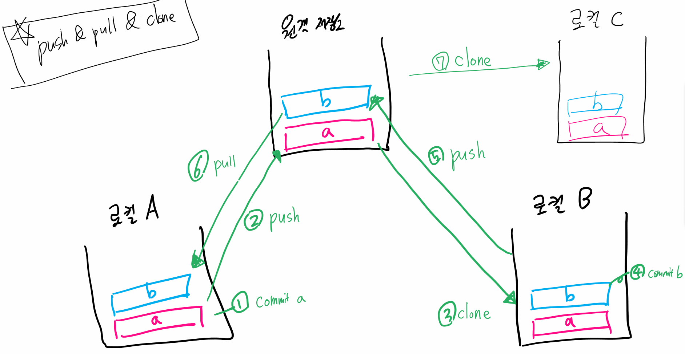

[toc]

## 원격 저장소 (Remote Repository)

기본설정

1. 로컬 git 저장소 준비
2. Github repository 생성
3. Repository default branch 변경 (settings -> repositories)
   - main -> master로 변경 (github웹)

<br>

## 명령어

#### 원격 저장소 주소 추가

```bash
$ git remote add origin 저장소URL
```

> "git아, 원격 저장소(remote) 추가해줘(add) origin 이라는 이름으로 저장소 URL을"

- origin은 원격 저장소 이름!

<br>

---

#### 원격 저장소 목록 보기

```bash
$ git remote -v
origin https:// ~~ (fetch)
origin https:// ~~ (push) 
```

> 잘못 add한 경우 삭제하는 방법
>
> ```bash
> $ git remote rm origin
> ```

<br>

---

#### 원격 저장소에 업로드(push)

```bash
$ git push -u origin master
```

>"git아, push해줘 origin이라는 이름의 원격저장소에 master 브랜치로"

>원격저장소에는 commit이 올라간다**
>
>드라이브의 개념이 아님! 파일이 올라가는게 아님!
>
>commit이 된 것만 올라감!!!**
>
>즉, commit 이력이 없다면 push 할 수 없다!

---

- ~~$ git push -u ~~ (-u 이후는 생략가능 처음에 푸시했으면)~~

- 대신 $ git push (origin master) 하나일때만 생략가능

---

## Pull

- 원격 저장소의 변경사항을 받아옴(업데이트)

```bash
$ git pull origin master
```

<br>

---

## Clone

- 원격 저장소를 전체를 복제

```bash
$ git clone 저장소URL
```

> [주의사항]
>
> clone받은 프로젝트는 이미 `git init`이 되어있음 (remote도 추가되어 있음)
>
> remote를 따로 하지 않아도 된다는 말
>
> 


