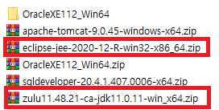

[toc]

# Java

## 00. 자바의 특징

- 이식성이 높은 언어
- 객체 지향 언어
- 함수적 스타일 코딩 지원
- 메모리를 자동으로 관리
  - c++은 메모리에 생성된 객체를 제거하기 위해 개발자가 직접 코드를 작성해야함
- 다양한 애플리케이션 개발 가능
- 멀티 스레드를 쉽게 구현가능
- 동적 로딩을 지원
- 막강한 오픈소스 라이브러리가 풍부



이클립스를 다운받고,,, zulu로 path설정,,,?<br>

---

<br>

## 01. 변수와 타입

### 변수

> 변수란, 하나의 값을 저장할 수 있는 메모리 공간
>
> 개발자는 변수 이름을 보고, 이 변수가 어떤 값을 저장하고 있는지 쉽게 알 수 있도록 의미 있는 변수 이름을 지어주는 것이 좋다.

- **< 작성규칙 >**
  - 첫번째 글자는 문자이거나 $, _ 이어야 하고 **<u>숫자로 시작할 수 없다</u>**. (필수)
  - 영어 대소문자가 구분된다. (필수)
  - 첫 문자는 영어 소문자, 다른 단어가 붙을 경우 첫 문자를 대문자로 (관례)
  - 문자 수 제한은 없다.
  - <u>**자바 예약어는 사용할 수 없다. (필수)**</u>
- 정수 리터럴
  - byte, char, short, int long
- 실수 리터럴
  - float, double
- 문자 리터럴
  - char
- 문자열 리터럴
  - String
- 논리 리터럴
  - boolean

> 변수는 초기화가 되어야 읽을 수 있다.<br>
> 초기화 되지 않은 변수는 읽을 수가 없다.
>
> 변수는 선언된 블록 내에서만 사용이 가능하다.

### 데이터 타입

> 기본(원시)타입이란 정수, 실수, 문자, 논리 리터럴을 직접 저장하는 타입을 말한다.
>
> 정수타입에는 모두 다섯개의 타입이 있고 메모리 순으로 나열하면<br>
> byte1, char2, short2, int4, long8 바이트 수가된다.
>
> ```java
> char c = ' ';
> String str = "";
> ```

### 타입 변환

> 데이터 타입을 다른 데이터 타입으로 변환 하는 것을 말함<br>
> 작은 크기 --> 큰 크기 는 자동으로 타입변환 됨<br>
> byte(1) < short(2) < int(4) < long(8) < float(4) < double(8)
>
> 큰 크기 --> 작은 크기 로 갈때 강제로 타입변환 할수도있음<br>
> 캐스팅 연산자( ) 를 이용

---

---

## 02. 연산자

### 연산자와 연산식

> +, -, *, ==는 연산자 x, y, z같은 변수는 피연산자<br>
> 연산식은 반드시 하나의 값을 산출

```java
x + y
x - y
x * y + z
x == y
    
단항 연산자: ++x;
이항 연산자: x + y;
삼항 연산자: (sum>90) ? "A" : "B";

int result = x + y;
boolean result = (x+y)<3;
```

### 연산의 방향과 우선순위

> 대입 연산자(=, +=, -=)는 오른쪽에서 왼쪽으로 연산
>
> ```java
> a = b = c = 5;
> ```
>
> 라면 c=5, b=c, a=b 순서로

### 단항 연산자

### 이항 연산자

- 논리곱(&&), 논리합(||), 배타적 논리합(^), 논리부정(!)
  - AND(논리곱): 피연산자가 모두 true일 경우에만 연산 결과는 true
  - OR(논리합): 피연산자 중 하나만 true이면 연산 결과는 true
  - XOR(배타적논리합): 피연산자가 하나는 true이고 다른 하나가 false일 경우에만 true

### 삼항 연산자

> (조건식) ? (값 또는 연산식) : (값 또는 연산식)

---

---

## 03. 조건문과 반복문

### 조건문(if문, switch문)

- if문
- if-else문
- if-else if-else문
- switch문

## 반복문(for문, while문, do-while문)

- for문
- while문

- do-while문
- break문
- continue문