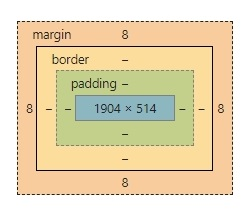

[toc]

# CSS3

---

<u>**:star:모든 contents들은 webContent 하위로 들어가야한다:star:**</u>

---

## CSS3 선택자

> CSS3에서 특정 HTML 태그를 선택할 때는 선택자를 사용함.<br>
>
> ```css
> h1{color:red;}
> ```
>
> css블록<br>h1: 선택자<br>
> color: 스타일속성<br>
> red: 스타일 값<br>
>
> **"h1 태그의 color 스타일 속성에 스타일 값으로 red를 적용한다."<br>**

### 1. 기본선택자

> 전체선택자 *<br>
> 태그 선택자 body h1 h2.. --> 많이 씀!<br>
> 아이디 선택자 #아이디 --> 많이 씀!, 유일성을 보장<br>
> 클래스 선택자 .클래스<br>
>
> ```html
> <style>
>     body, p, h1, h2, h3 {margin:0; padding:0;}
> </style>
> ```
>
> 여러개를 쉼표로 연결하고 margin 스타일속성, padding 스타일 속성 적용<br>

:star:**<u>" 웹 페이지 내부에서 id 속성을 중복해서는 안됨"</u>**:star:

```html
<div id="header">
</div>
<div id="wrap">
</div>
<div id="content">
</div>
```

> `클래스 선택자` - 태그이름이 달라도 어떤 클래스에 소속돼있으면 일괄적용

```html
<style> .select{ color:red; } </style>
<li class="select">가</li>
<li>나</li>
<li class="select">다</li>
<li>라</li>

<style> //클래스를 더 정교화시킬수도있다. h1.a 이런식으로
    .a {color: red; }
    .b{ background-color: blue; }
    .c{ color: yellow; }
</style>

<h1 class="a b c"></h1> //순서 바꿔도 style내의 순서로 덮어씌워짐 cascading
```

### 2. 속성 선택자

> 선택지[속성] - 특정한 속성이 있는 태그 선택<br>
> 선택지[속성=값] - 특정한 속성 내부 값이 특정 값과 같은 태그 선택

### 3. 후손 선택자와 자손 선택자

### 4. 반응, 상태, 구조 선택자

> `:active` - 사용자가 마우스를 클릭한 태그 선택<br>
> `:hover` - 사용자가 마우스 커서를 올린 태그 선택<br>

> `:checked` - 체크상태의 input 태그 <br>
> `:focus` - 포커스를 맞춘 input 태그<br>
> `:enabled` - 사용 가능한 input 태그<br>
> `:disabled` - 사용 불가능한 input 태그<br>

> `:first-child`<br>
> `:last-child`<br>
> `:nth-child(수열)`<br>
> `:nth-last-child(수열)`<br>

**<u>:star:주석 나타내는법 HTML5/CSS:star:</u>**

```html
<!-- 주석 -->
```

```css
/* 주석 */
```

## CSS3 단위

> `키워드 단위` - W3C에서 미리 정의한 단어<br>
> `크기 단위` - 가장 많이 사용하는 단위 %(백분율단위), em(배수단위), px(픽셀단위)
>
> - { font-size: 200% } 
> - { font - size: 2.0em;} 
> - { font-size: 32px}<br>
>
> `색상 단위` - RGB색상, RGBA색상, HEX코드
>
> - { background-color: rgb(255, 255, 255); }
> - { background-color: rgba(255, 255, 255, 0.5); }
> - { background-color: #000000; } 16진수<br>
>
> `URL 단위` 
>
> - background-img: url('filename.jpg');
> - background-img: url('folder/filename.jpg');<br>

---

## CSS3 속성

### 1. 박스속성



