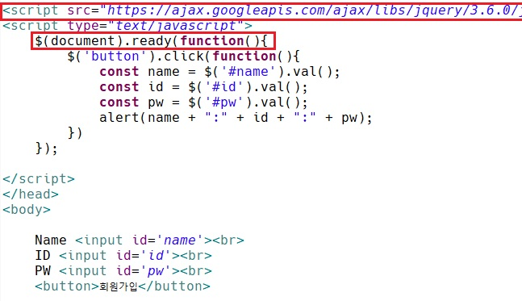
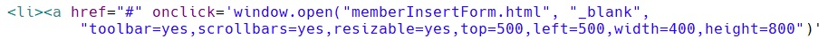
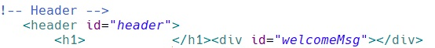
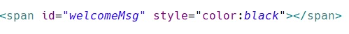
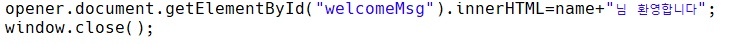

[toc]

# 웹 페이지 만들어보기

### 01 sign_up_form.html

- 1x main.html, 1x sign_up_form.html 

1. `main.html`에 링크를 걸어줄 `sign_up_form.html`코드를 만들기
2. `jQuery CDN` 가져오기
3. `jQuery 사용` 코드
4. `Input`을 이용해서 3개의 칸 만들기
5. 버튼을 클릭했을 때 `alert`로 값을 볼 수 있게하기 

1. `main`으로 가서 onclick을 이용해 원하는 곳에 `window.open`후 `sign_up_form.html`링크를 걸어준다.
2. 새창으로 띄우고 싶으면 `_blank`, 기존창에 띄우고 싶으면 `_self`등이 있다.
   - https://www.w3schools.com/jsref/met_win_open.asp

---

### 02 메시지 띄워주기 & 창 닫기 (보통 login때, 우리는 sing-up때 연습)

> `main`에서 원하는 텍스트 옆에 웰컴메시지를 띄울 수 있게 id를 지정해준다. 

> `sign_up_form`에서 웰컴메시지를 불러와서 innerHTML을 통해 메시지를 출력한다. `innerHTML` 대신 `textContent`를 써도된다. 글자색이 잘 안보이면 `style="color:black"`을 통해 색을 지정해줄 수도 있다.

> 그래서 회원가입에서 Name에 홍길동을 입력하면 회원가입 후 창이 닫히고 검은색 글씨의 `홍길동`님 환영합니다 메시지가 나온다. 

---

SPA 대신 여러페이지로 나눠서 페이지 왔다갔다 필요할 때

주소창에 C://Users ... 파일경로 http:// ...로

---

> 초창기 WebStie html폴더에 1.html ~... css폴더에 1.css ~... js폴더에 1.js ~... img폴더, res폴더 페이지에 다 링크가 걸려있음

> Web 2.0 시대 SPA(한페이지 안에 다 할 수 있을 때) 웹브라우저와 서버가 있으면 서버에서 첫페이지를 아주 정교하게 잘 만들음 CGI

> Multi + SPA (네이게이션을 통해 섹션이 많을 때)

> 웹을 만들때 SPA로 할건지 멀티페이지로 할건지 전략을 먼저 세워야함