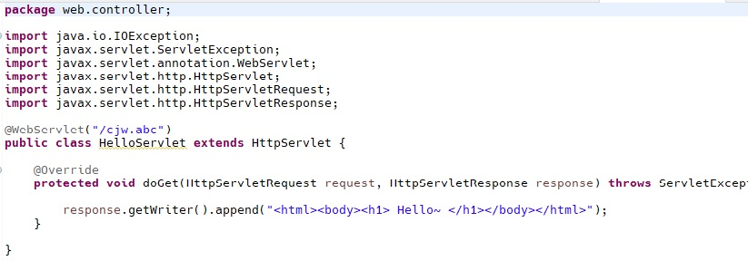
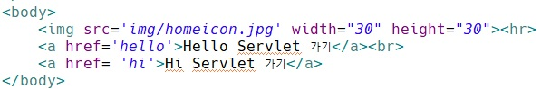
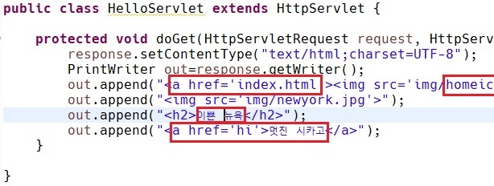
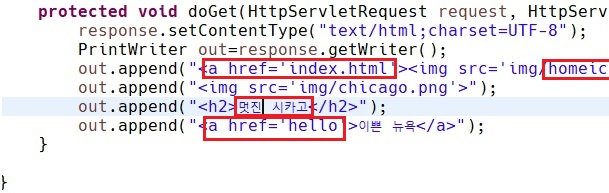

[toc]

# Servlet

> 1. 정적데이터만 전달하는 `Web Server`

> 2. 동적 데이터를 처리하는 `CGI`(Common Gateway Interface)<br>
>    CGI: Web Server와 프로그램 사이의 규약<br>
>    CGI는 많은 사용자를 처리하기엔 무리

> 3. CGI를 보완한 `Servlet`<br>
>    Web Server는 정적데이터를 처리하고(Apache)<br>Web Application Server는 동적데이터를 처리(Tomcat)

> `Init`: Servlet Instance 생성<br>`Service`: 실제 기능이 수행되는곳<br>`Destroy`: Servlet Instance가 사라짐

> Web.xml(설정파일) Servlet Mapping<br>WAS에게 Servlet 객체 - URL mapping 정보를 알려준다.

---

## Servlet 이클립스에서 만들기

> File - New - Dynamic Web Project<br>런타임은 Apache Tomcat v9.0 모듈버전은 4.0 혹은 2.5 선택

> 프로젝트가 만들어진 후 해당 프로젝트 선택한 뒤<br>New - Servlet 선택<br>`
> Java package` 이름은 web.controller `Class name`은 마음대로
> `URL Mapping` 을 name과 다른 이름으로 바꿔준다 (보안상의 이유, 이게 Servlet 파일이라는걸 알려줄 필요가X)<br>`
> Constructors from superclass`, `doPost` 체크**<u>풀고</u>** Finish

> `html` `css` `js` 이미지를 담는`img` mp3, mp4를 담는`rs` 같은 파일들은 정적데이터 이므로 ` WebContent`폴더 밑에 폴더를 만들어서 `폴더 아래` 혹은 `파일` 형태로 저장해준다.



> 작성한 후 필요없는 line들은 지워준 모습

> 한국어적용은
>
> ```java
> response.setContentType("text/html;charset=UTF-8");
> ```
>
> 꼭 `;`을 사용해준다. `:` 사용하면 오류

> `html`에서는 ' '와 " "를 위치를 바꿔써도 될 만큼 제약이 약한데<br>`java`에서는 " "이 바깥 ' '이 안쪽에 와야한다.

---

## 홈페이지 바로가기 버튼 만들기

> 서블릿은 링크 처리를 하기위함<br>홈페이지 바로가기, 회원가입, 로그인, 장바구니 넣기, 구매하기를 눌렀을 때 페이지를 이동시킬 때 사용한다.

> `index.html` 만들어서<br><a href></a>로 페이지 왔다갔다

- 홈페이지 버튼 만들기

  - 홈페이지 icon을 구한다.
  - `index.html`에 버튼 만들어 준다. (크기조절은 width, height)

  

  - `Servlet`에도 똑같이 만들어준다. `Servlet`에는 index.html에 `a태그`

  



> 이렇게 하면 `index.html` 로 갈수있게 하는 home icon과<br>멋진시카고를 눌렀을 때 멋진시카고`(hi)`로, 이쁜뉴욕을 눌렀을 때 이쁜뉴욕`(hello)`으로 갈 수 있다.