서버구축해보기 (기본)

1. starter project

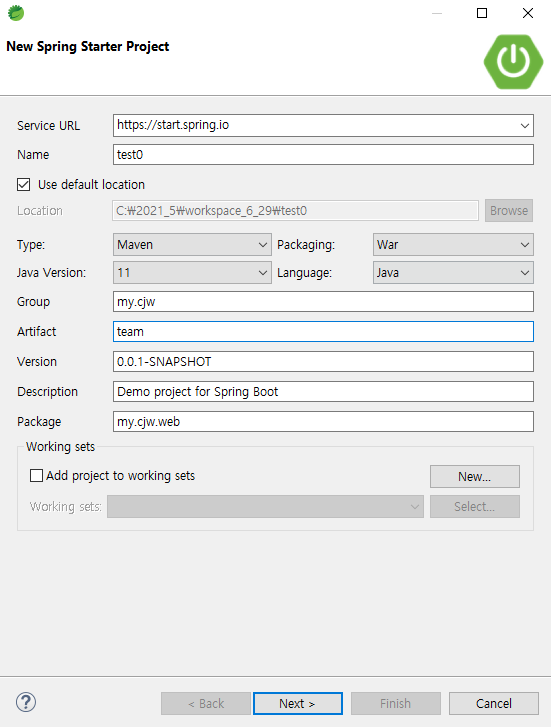

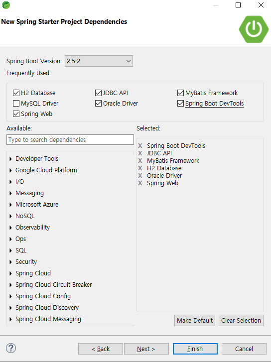

2. app properties 에서 server port설정(세션값은 기본 30분)

   server.port=8090

3. Controller 생성. @RestController, @PostMapping("method이름"), @ModelAttribute

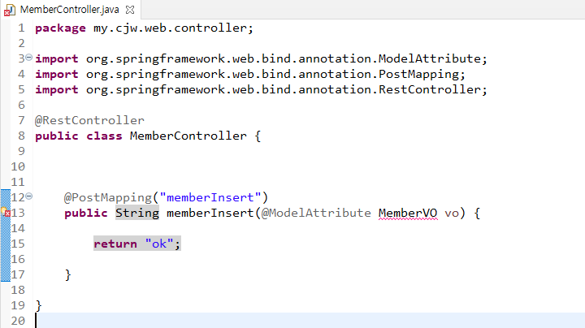

4. MemberVO 생성 

private String id, pw, name, msg;

set,get methods, toString

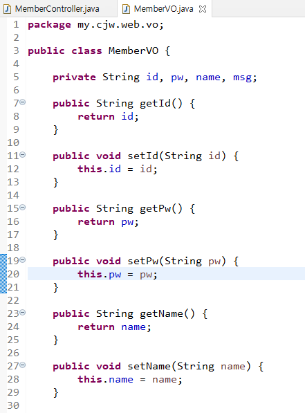

5. Postman으로 한번 실행해본다.

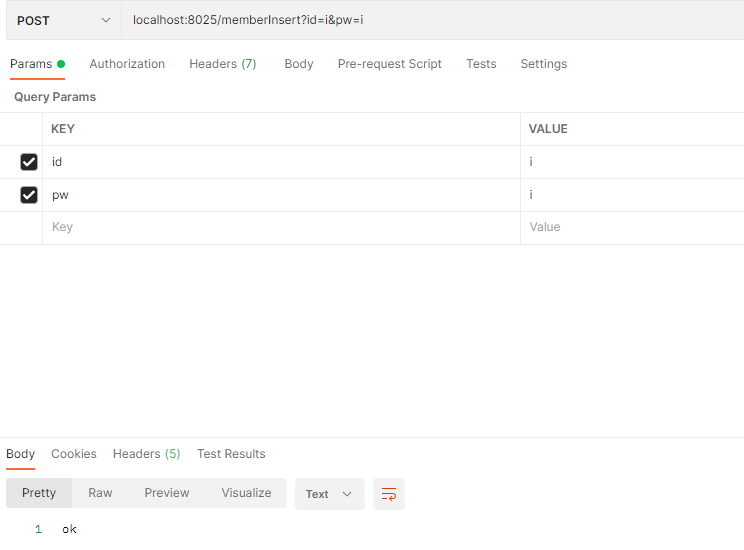

​	console창에는 MemberVO [id=i, pw=i, name=null, msg=null] 라고 출력됨.

6. Controller로 가서 @Autowired MemberService memberInsert;

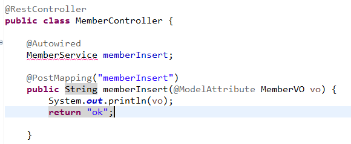

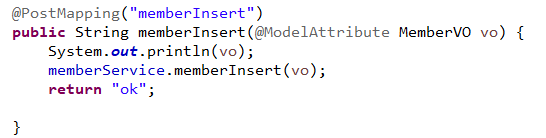

MemberService에 이런 서비스 없으니 memberService.memberInsert 만들어달라.

7. MemberService에 memberInsert 만듦 @Service, @Autowired MemberDAO, memberDAO; 도 해준다.

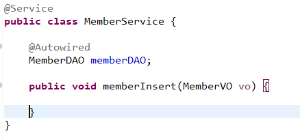

8. MemberDAO 생성

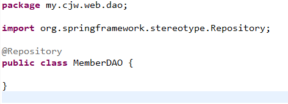

9. MemberService에서는 memberDAO.memberInsert(vo);호출

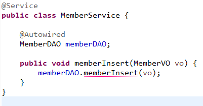

10. DAO에 memberInsert만들어줌

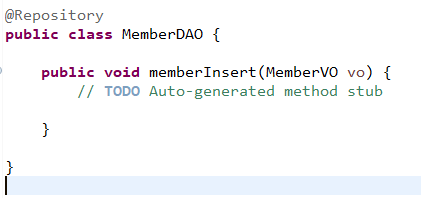

11. DB연동해야함

@Autowired SqlSession sqlSession;

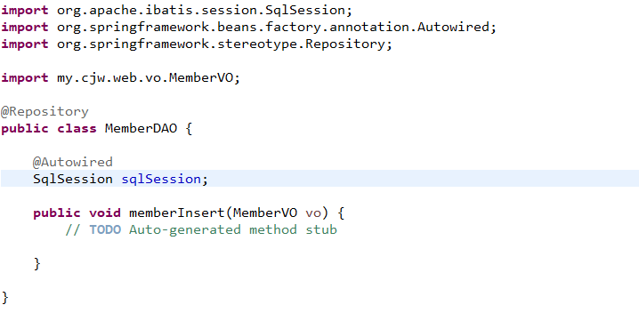

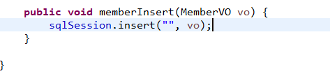

12. DB설정 application properties

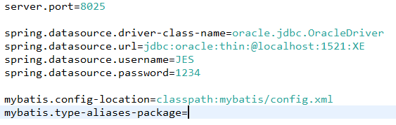

13. resources밑에 mybatis.config.xml 생성

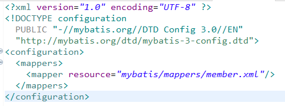

14. mybatis/mappers/member.xml 생성

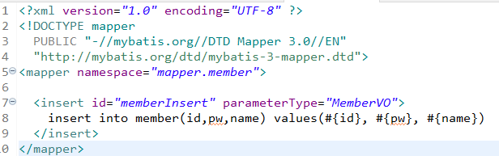

15. DAO에서 sqlSession에

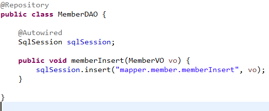

16. application properties가서 mybatis type aliases 해줘야함

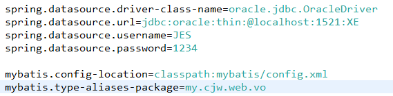

17. postman 으로 확인

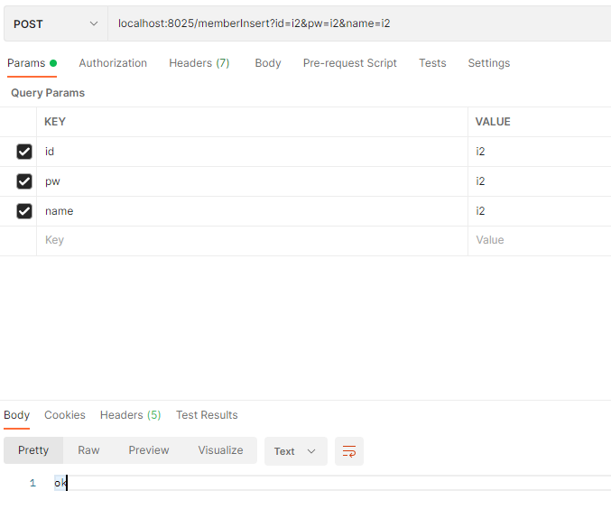

console창에는 MemberVO [id=i2, pw=i2, name=i2, msg=null] 라고 나온다.