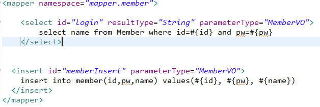

1.  jackson databind maven


2. 연관된 core도 같이 받기


3. porn.xml에 추가해주기


> databinded, core 들은 VO를 자동으로 jason으로 바꿔준다.
>
> postman으로 돌려보면 JSON형태로 return하는걸 볼 수 있음

> set,get method는 null체크, 유효한 범위 값 설정, pw패턴 설정

<hr>

<hr>

1. Controller에서 login기능도 똑같이 만들어보기


2. Service에 login 만들어주기


3. DAO에 login 만들어주기


mapper.member.(method이름) 패턴이 있으므로 미리 작성해준다.

4. member.xml 가서 <select></select> 구문 완성해준다.



resultType은 String, 그리고 테이블에서 id, pw 찾아주기

5. Service에서 void를 String 으로 그리고 memberDAO.login(vo)를 return해준다.


6. DAO부분을 String으로 받아줌


> 주의!!! 위에따라서 insert라고 했는데, 로그인이므로 회원가입때쓰는 insert가 아니라<br>sqlSession.selectOne이 되야함.


7. Controller에서


이부분을


이렇게 바꿔준다. memberService.login(vo); 를 String name으로 받아줌.

원래 이렇게 까지 하고 try, catch 했어야 했다.

그러면 원래대로라면

```java
public MemberVO login(@ModelAttribute MemberVO vo){
    
    System.out.println(vo);
    String name=memberService.login(vo);
    vo.setName(name);

    vo.setPw(null);
    return vo;
}
```

에서 마지막에 Pw가 보이지 않게 vo.setPw(null);로 처리해주고 return해준다.

로그인 실패시 Msg로 로그인 실패가 보이게.

이러기 위해 처음부터 vo에 msg도 넣었음.

8. Postman으로 실행해보기


Console창에는 MemberVO [id=i, pw=i, name=null, msg=null]

