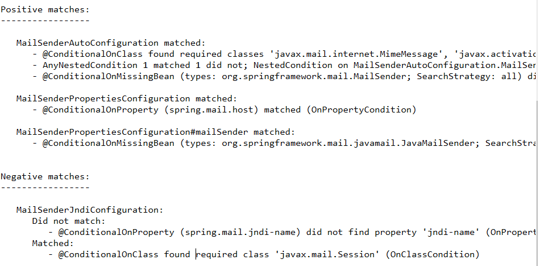
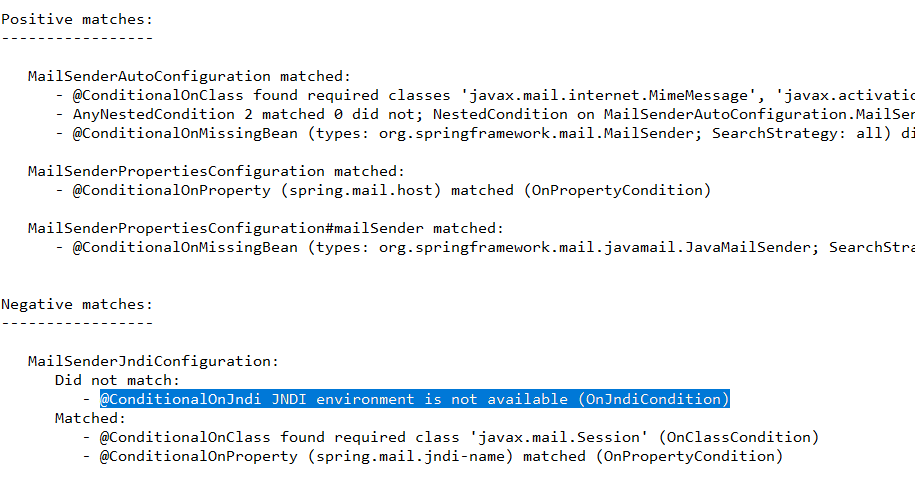

에러를 하나하나 다 기록해보면 나중에 문제점을 알 수 있지 않을까 해서 만든 문서

##### org.springframework.beans.factory.UnsatisfiedDependencyException:

빈 생성시에 필요한 것이 빠졌거나, 잘못되었으니 고쳐보아라

Controller, Service, Repository 어노테이션 확인

,

##### Error resolving JdbcType. Cause: java.lang.IllegalArgumentException: No enum constant org.apache.ibatis.type.JdbcType.NUMBER

Mybatis를 활용해 insert, update 시 변수의 값이 없을 시 부적합한 열 유형 (해당 변수=null) 에러가 발생합니다.

이를 처리하기 위해서는 if 태그를 활용하는 방법과

jdbc type을 설정해 주는 방법이 있습니다.

varchar형은 jdbcType=VARCHAR

number형은 jdbcType=INTEGER

출처: https://aljjabaegi.tistory.com/420 [알짜배기 프로그래머]

##### ### Error updating database.  Cause: java.sql.SQLIntegrityConstraintViolationException: ORA-01400: cannot insert NULL into ("SWL"."CUSTOMER"."CUST_NUM")

오라클은 auto_increment가 안되서 null값 허용안한거를 sequence처리해줘야함

##### ### Error updating database.  Cause: java.sql.SQLSyntaxErrorException: ORA-00911: invalid character

세미콜론빼주기 xml에서 sql문쓸때

##### ### Error updating database.  Cause: java.sql.SQLSyntaxErrorException: ORA-00933: SQL command not properly ended

해결 방법

\1. 쉼표 제대로 썻는지 확인하기

\2. 조건절 WHERE를 제대로 썻는지 확인하기 EX) WHERE절 두번X

\3. 괄호 확인하기

\4. 띄어쓰기 확인하기

\5. 오타 확인하기 EX) ORDER BY가 ODRDEB BY가 되어 있거나

테이블명에 AS로 별칭을 줘도 에러가 난다.

출처: https://alisyabob.tistory.com/91 [it 공부 끄적이기]

##### **CREATE SEQUENCE tmp_seq START WITH 1 INCREMENT BY 1 MAXVALUE 100 CYCLE NOCACHE;**

시퀀스 오라클에 입력하는법

CREATE SEQUENCE tmp_seq START WITH 1 INCREMENT BY 1 MAXVALUE 1000 CYCLE NOCACHE;

rename tmp_seq to seq_cust;

하고 xml에서

  	insert into customer(cust_num) values(seq_cust.NEXTVAL)

##### <![CDATA[ 사용이유

Mybatis 사용시 쿼리문에 문자열 비교연산자나 부등호를 처리할 때가있습니다.

그러면 < 와 같은 기호를 괄호인지 아니면 비교연산자 인지 확인이 되지않아요.

이외에도 특수문자 사용하는데 제한이있습니다.

이럴때 사용한것이 **<![CDATA[**  입니다.

CDATA 안에 들어가는 문장을 문자열로 인식하게 합니다.

출처: https://javacpro.tistory.com/5 [버물리의 IT공부]

##### @ConditionalOnProperty (spring.mail.jndi-name) did not find property 'jndi-name'

https://stackoverflow.com/questions/41741135/spring-boot-auto-configuration-for-datasource

https://pythonq.com/so/java/185087

https://godekdls.github.io/Spring%20Boot/sending-email/ jndi

#####  @ConditionalOnJndi JNDI environment is not available 

https://stackoverflow.com/questions/42699161/not-able-to-start-springboot-app-in-debug-mode-closing-org-springframework-cont

##### annotation은 각 한개씩