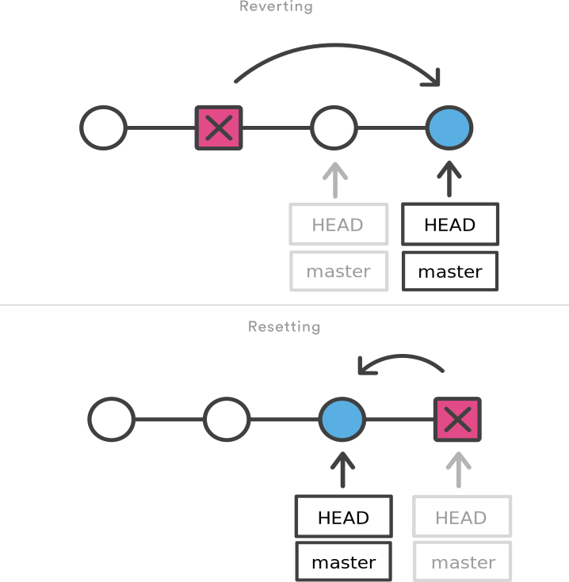

[toc]

# Reset vs Revert

## Reset

> https://git-scm.com/docs/git-reset
>
> "시계를 마치 과거로 돌리는 듯한 행위"
>
> 특정 커밋으로 되돌아가며 되돌아간 특정 커밋 이후의 커밋들은 모두 사라지며,
>
> 파일 상태는 옵션을 통해 결정

<br>

### 3가지 옵션 - soft, mixed, hard

1. ##### `--soft`

   - 돌아가려는 commit으로 되돌아가고,
   - 이후의 commit된 파일들을 `staging area`로 돌려놓음 (commit 하기 전 상태)
   - 즉, 다시 커밋할 수 있는 상태가 됨

2. ##### `--mixed`

   - 돌아가려는 commit으로 되돌아가고,
   - 이후의 commit된 파일들을 `working directory`로 돌려놓음 (add 하기 전 상태)
   - 즉, unstage 된 상태로 남아있음
   - 기본값

3. ##### `--hard`

   - 돌아가려는 commit으로 되돌아가고,
   - 이후의 commit된 파일들 (`tracked 파일들`)은 모두 working directory에서 삭제
   - 단 Untracked 파일은 Untracked로 남음

```bash
# --hard 예시

$ git log --oneline

$ git reset --hard <해쉬코드>

$ git log --oneline

$ git status
```

> `reset`은 과거로 돌아가게 되면 돌아간 commit 이후의 commit은 모두 히스토리에서 사라짐
>
> commit 히스토리가 바뀌기 때문에 다른 사람과 공유하는 브랜치에서 사용 시 충돌이 발생
>
> 공유하는 브랜치에서 이전 커밋을 수정하고 싶을 때는 `git revert` 사용

<br>

---

<br>

## Revert

> https://git-scm.com/docs/git-revert
>
> "특정 사건을 없었던 일로 만드는 행위"
>
> 이전 commit 내역을 그대로 남겨둔 채 새로운 커밋을 생성
>
> commit 히스토리 변경 없이 해당 commit 내용만을 삭제한 상태의 새로운 commit을 생성

```bash
$ git log --oneline

# revert commit 편집기 실행 하고 관찰

$ git revert <해쉬코드>

$ git log --oneline
```

> 다른 사람과 공유하는 브랜치에서 이전 commit을 수정하고 싶을 때 사용
>
> commit 히스토리가 바뀌지 않기 때문에 충돌이 발생하지 않음

<br>

---

