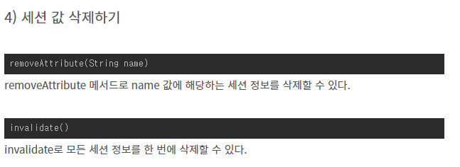

웹 통신간 유지하려는 정보를 저장 하는 목적

https://developer.mozilla.org/ko/docs/Web/HTTP/Cookies

# 쿠키(Cookie)

HTTP의 일종으로 사용자가 어떠한 웹 사이트를 방문할 경우,
그 사이트가 사용하고 있는 서버에서 **사용자의 컴퓨터에 저장하는 작은 기록 정보 파일**이다.

HTTP에서 클라이언트의 상태 정보를 클라이언트의 PC에 저장하였다가
**필요시 정보를 참조하거나 재사용할 수 있다.**

- **쿠키 특징**

  1. 이름, 값, 만료일(저장 기간 설정), 경로 정보로 구성되어 있다.

  2. 클라이언트에 총 300개의 쿠키를 저장할 수 있다.

  3. 하나의 도메인 당 20개의 쿠키를 가질 수 있다

  4. 하나의 쿠키는 4KB(=4096byte)까지 저장 가능하다.

     

- **쿠키의 동작 순서**

  1. 클라이언트가 페이지를 요청한다. (사용자가 웹사이트 접근)

  2. 웹 서버는 쿠키를 생성한다.

  3. 생성한 쿠키에 정보를 담아 HTTP 화면을 돌려줄 때,
     같이 클라이언트에게 돌려준다.

  4. 넘겨 받은 쿠키는 클라이언트가 가지고 있다가(로컬 PC에 저장)
     다시 서버에 요청할 때 요청과 함께 쿠키를 전송한다.

  5. 동일 사이트 재방문시 클라이언트의 PC에 해당 쿠키가 있는 경우,
     요청 페이지와 함께 쿠키를 전송한다.

     

- **사용 예시**

  1. 방문했던 사이트에 다시 방문 하였을 때 아이디와 비밀번호 자동 입력
  2. 팝업창을 통해 "오늘 이 창을 다시 보지 않기" 체크

출처: https://hahahoho5915.tistory.com/32 [넌 잘하고 있어]

### 쿠키의 용도

쿠키가 있기 때문에 여러 페이지를 이동할 때마다 로그인을 하지 않고 사용자 정보를 유지할 수 있는 것입니다. (쿠키가 없다면 다음 페이지로 정보를 파라미터로 넘겨줘야 합니다.)

- ID 저장, 로그인 상태 유지
- 7일간 다시 보지 않기. (쿠키에 체크한 날짜를 기록하여 다시 방문 했을 때의 시간과 시차를 이용하여 계산)
- 최근 검색한 상품들을 광고에서 추천
- 쇼핑몰 장바구니 기능

https://cjh5414.github.io/cookie-and-session/

# 세션(Session)

출처: https://enai.tistory.com/29

일정 시간동안 같은 사용자(브라우저)로부터 들어오는
일련의 요구를 하나의 상태로 보고, 그 상태를 일정하게 유지시키는 기술이다.

여기서 일정 시간은 방문자가 웹 브라우저를 통해
웹 서버에 접속한 시점으로부터 웹 브라우저를 종료하여 연결을 끝내는 시점을 말한다.

즉, **방문자가 웹 서버에 접속해 있는 상태를 하나의 단위로 보고 그것을 세션**이라고 한다.

- 세션 특징

  1. 웹 서버에 웹 컨테이너의 상태를 유지하기 위한 정보를 저장한다.

  2. 웹 서버의 저장되는 쿠키(=세션 쿠키)

  3. 브라우저를 닫거나, 서버에서 세션을 삭제했을때만 삭제가 되므로,
     쿠키보다 비교적 보안이 좋다.

  4. 저장 데이터에 제한이 없다.(서버 용량이 허용하는 한...)

  5. 각 클라이언트 고유 Session ID를 부여한다.
     Session ID로 클라이언트를 구분하여 각 클라이언트 요구에 맞는 서비스 제공

     

- 세션의 동작 순서

  1. 클라이언트가 페이지를 요청한다. (사용자가 웹사이트 접근)

  2. 서버는 접근한 클라이언트의 Request-Header 필드인 Cookie를 확인하여,
     클라이언트가 해당 session-id를 보냈는지 확인한다.

  3. session-id가 존재하지 않는다면,
     서버는 session-id를 생성해 클라이언트에게 돌려준다.

  4. 서버에서 클라이언트로 돌려준 session-id를 쿠키를 사용해 서버에 저장한다.
     쿠키 이름 : JSESSIONID

  5. 클라이언트는 재접속 시,
     이 쿠키(JSESSIONID)를 이용하여 session-id 값을 서버에 전달

     

- 사용 예시

  - 화면이 이동해도 로그인이 풀리지 않고 로그아웃하기 전까지 유지

https://hahahoho5915.tistory.com/32

### 세션의 특징

- 세션 아이디는 브라우저 단위로 저장되고 브라우저 종료시 소멸됩니다.
- 로그인한 사용자에 대해서만 세션을 생성하는 것이 아닙니다. 따라서 로그아웃하면 새로운 사용자로 인식해서 새로운 세션이 생성됩니다.
- 사용자가 로그인 했는지, 닉네임 등의 사용자가 요청 할 때 마다 필요한 청보들을 세션에 담아두면 사용자 디비에 접근할 필요가 없어서 효율적입니다.

### 보안

누군가 어떤 사용자의 세션 아이디를 훔친다면 그 사용자처럼 로그인할 수 있게 됩니다. https를 이용해서 통신 하는 것이 좋고 cookie와 마찬가지로 session의 옵션으로 secure을 true로 주면 https에서만 세션 정보를 주고받을 수 있고 HttpOnly을 true를 주면 js를 통해서 세션 쿠키를 사용할 수 없도록 강제할 수 있습니다.

https://cjh5414.github.io/cookie-and-session/

출처: https://hahahoho5915.tistory.com/32 [넌 잘하고 있어]

