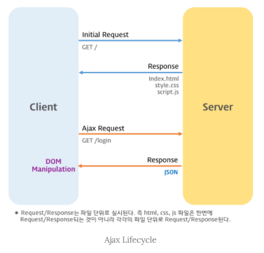

JSP(프론트)  에서 Controller(백엔드)로 데이터 전송

JSP에서 Controller로 데이터 전달

프론트에서 백엔드 영역으로 데이터가 이동하는 경우는 GET, POST방식이 있는데

이 방식을 Form-Action을 통해 구현하기도 하고, Ajax를 이용하거나 혹은 location href를 통해 바로 URL주소에 태워서 보내기도 함.


### Form-Action

가장 기본적인 전달방식 form 태그를 이용,

JSP영역에서

```jsp
<form action="memberRegi.do" method="post">
	이름 : <input type="text" name="userName"><br>
	계정 : <input type="text" name="userId">
	<input type="submit" value="전송버튼">
</form>
```

보내고자 하는 데이터에 name 속성지정

action태그에서는 보내고자 하는 컨트롤러 url에 매핑

받아주는 controller에서는 파라미터로 받아주면 되는데 이때 받아주는 파라미터의 이름은 JSP파일에서 설정한 name과 동일하게 적어주면 자동으로 파라미터 변수에 들어옴.

파라미터에 객체(DTO)를 넣어줘도 자동으로 객체에 값이 들어온다.

```java
@RequestMapping(value = "memberRegi.do", method = RequestMethod.POST)
public void memberRegi(Locale locale, Model model, String userName, MemberDto dto) {
  System.out.println(userName);
  System.out.println(dto.getUserName());
  System.out.println(dto.getUserId());
}
```

이름은 userName이라는 이름으로 전송을 하고

계정은 userId라는 이름으로 컨트롤러에 전송

컨트롤러에서는 Spring userName이라는 String 타입의 변수와 MemberDto라는 객체로 데이터를 받고있음

당연히 dto에는 userName, userId라는 이름으로 변수가 선언되어 있을것

결과적으로 jsp에서 이름에 입력한 값은 String userName과 dto의 userName모두에게 들어오고, 계정란에 입력한 값은 dto의 userId를 통해 받을 수 있음.

dto에는 getter, setter함수 선언되있어야함.


GET방식으로도 전송이가능

JSP의 form태그에서 method="GET"으로 변경하고 컨트롤러에서 method를 RequestMethod.GET으로 바꾸면 됨

get방식으로 전송을 하면 당연히 url을 통해서 데이터가 전송됨 

**'http://localhost:8090/java/memberRegi.do?userName=33&userId=44'** 이런식으로

이걸 응용하면 form태그 없이 url주소만으로 데이터전송 시도 가능

```
<button onclick='location.href="memberRegi.do?userName=33&userId=44";'>url전송</button>
```


### Ajax방식을 이용한 데이터 전송

Ajax는 j쿼리의 ajax를 이용해서 전송하는것

```js
<script>

var userName = "이순신";

function ajax(){

  $.ajax({
    url: "memberRegi.do",
    data: "userName=" + userName,
    type: "POST",
    success : function(data){
      alert("성공")
    },
    error : function(){
      alert("에러")		
    }
  });
}

</script>
```

```java
@ResponseBody
@RequestMapping(value = "memberRegi.do", method = RequestMethod.POST)
public void memberRegi(String userName, MemberDto dto, HttpServletRequest request) {
  System.out.println(request.getParameter("userName"));
  System.out.println(dto.getUserName());
  System.out.println(userName);
}
```

Ajax(Asynchronous JavaScript and XML)는 자바스크립트를 이용해서 **비동기적(Asynchronous)**으로 서버와 브라우저가 데이터를 교환할 수 있는 통신 방식을 의미한다.

서버로부터 웹페이지가 반환되면 화면 전체를 갱신해야 하는데 페이지 일부만을 갱신하고도 동일한 효과를 볼 수 있도록 하는 것이 Ajax이다. 페이지 전체를 로드하여 렌더링할 필요가 없고 갱신이 필요한 일부만 로드하여 갱신하면 되므로 빠른 퍼포먼스와 부드러운 화면 표시 효과를 기대할 수 있다.



## HTTP의 GET과 POST 비교

둘 다 HTTP 프로토콜을 이용해서 서버에 무엇인가를 요청할 때 사용하는 방식이다. 하지만 둘의 특징을 제대로 이해하여 기술의 목적에 맞게 알맞은 용도에 사용해야한다.

### GET

우선 GET 방식은 요청하는 데이터가 `HTTP Request Message`의 Header 부분에 url 이 담겨서 전송된다. 때문에 url 상에 `?` 뒤에 데이터가 붙어 request 를 보내게 되는 것이다. 이러한 방식은 url 이라는 공간에 담겨가기 때문에 전송할 수 있는 데이터의 크기가 제한적이다. 또 보안이 필요한 데이터에 대해서는 데이터가 그대로 url 에 노출되므로 `GET`방식은 적절하지 않다. (ex. password)

### POST

POST 방식의 request 는 `HTTP Request Message`의 Body 부분에 데이터가 담겨서 전송된다. 때문에 바이너리 데이터를 요청하는 경우 POST 방식으로 보내야 하는 것처럼 데이터 크기가 GET 방식보다 크고 보안면에서 낫다.(하지만 보안적인 측면에서는 암호화를 하지 않는 이상 고만고만하다.)

*그렇다면 이러한 특성을 이해한 뒤에는 어디에 적용되는지를 알아봐야 그 차이를 극명하게 이해할 수 있다.* 우선 GET 은 가져오는 것이다. 서버에서 어떤 데이터를 가져와서 보여준다거나 하는 용도이지 서버의 값이나 상태 등을 변경하지 않는다. SELECT 적인 성향을 갖고 있다고 볼 수 있는 것이다. 반면에 POST 는 서버의 값이나 상태를 변경하기 위해서 또는 추가하기 위해서 사용된다.

부수적인 차이점을 좀 더 살펴보자면 GET 방식의 요청은 브라우저에서 Caching 할 수 있다. 때문에 POST 방식으로 요청해야 할 것을 보내는 데이터의 크기가 작고 보안적인 문제가 없다는 이유로 GET 방식으로 요청한다면 기존에 caching 되었던 데이터가 응답될 가능성이 존재한다. 때문에 목적에 맞는 기술을 사용해야 하는 것이다.


### JSON

클라이언트와 서버 간에는 데이터 교환이 필요하다. [JSON(JavaScript Object Notation)](http://www.json.org/json-ko.html)은 클라이언트와 서버 간 데이터 교환을 위한 규칙 즉 데이터 포맷을 말한다.

JSON은 일반 텍스트 포맷보다 효과적인 데이터 구조화가 가능하며 [XML](https://ko.wikipedia.org/wiki/XML) 포맷보다 가볍고 사용하기 간편하며 가독성도 좋다.

자바스크립트의 객체 리터럴과 매우 흡사하다. 하지만 **JSON은 순수한 텍스트로 구성된 규칙이 있는 데이터 구조이다.**

JSON.stringify 메소드는 객체를 JSON 형식의 문자열로 변환한다.

JSON.parse 메소드는 JSON 데이터를 가진 문자열을 객체로 변환한다.


Controller에는 각각 String, dto, request 객체를 이용해서 데이터를 받고 있는데

ajax가 호출하는 컨트롤러에 @ResponseBody 꼭 써줘야함 (@RestController면 안써줘도됨)

- Spring 4.0 introduced the *@RestController* annotation in order to simplify the creation of RESTful web services. **It's a convenient annotation that combines \*@Controller\* and \*@ResponseBody\***


- =는 대입, ==는비교, ===타입까지?
- {} 안에들어가는건 객체라서 .으로 값만 가져올수있음

- id찾기, pw찾기

- 화면 내 어떤 공간에 텍스트 표시해주고싶을때 <div>로 영역을 만들어주고 id부여한 뒤에 ajax에서 text 부여 해주기

- ajax로 보낼때는 VO값이랑 변수이름 같게 id, pw

- ==이 안먹히면 .equals 써보기
- .val(), .text()

