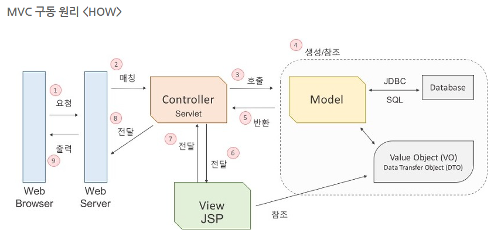

# MVC

### Controller

일종의 조정자, 클라이언트의 요청을 받았을 때, 그 요청에 대해 실제 업무를 수행하는 모델 컴포넌트를 호출

### Model

컨트롤러가 호출할 때, 요청에 맞는 역할을 수행.

비즈니스 로직을 구현하는 영역으로 응용프로그램에서 데이터를 처리하는 부분

### View

컨트롤러로부터 받은 모델의 결과값을 가지고 사용자에게 출력할 화면을 만드는 일

#### 

출처: https://asfirstalways.tistory.com/180

1. 웹 브라우저가 서버에 실행을 요청
2. 서버는 들어온 요청을 처리할 수 있는 서블릿을 찾아서 요청을 전달(매칭)
3. 서블릿은 모델 자바 객체의 메서드를 호출
4. JDBC를 사용하여 DB를 통해 값 객체를 생성
5. 결과값을 컨트롤러에 반환
6. 컨트롤러는 받은 결과값을 뷰에 전달
7. JSP는 전달받은 값을 참조하여 출력할 결과 화면을 컨트롤러에 전달
8. 뷰로부터 받은 화면을 웹 서버에 전달
9. 웹서버에서 웹브라우저로 출력