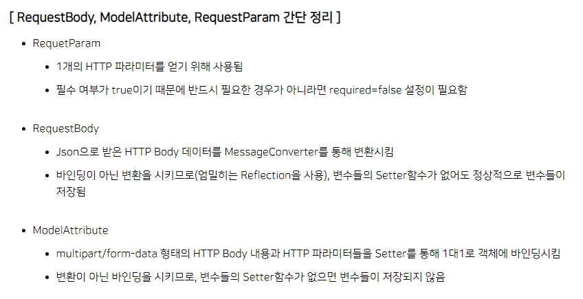

### **[ \**@RequestParam\** ]**

@RequestParam은 1개의 HTTP 요청 파라미터를 받기 위해서 사용한다. @RequestParam은 필수 여부가 true이기 때문에 기본적으로 반드시 해당 파라미터가 전송되어야 한다. 해당 파라미터가 전송되지 않으면 400 Error를 유발하게 된다. 그렇기 때문에 반드시 필요한 변수가 아니라면 required의 값을 false로 설정해둘 수 있으며 해당 Parameter를 사용하지 않고 요청을 보낼 경우에 default로 받을 값을 defaultValue 옵션을 통해 설정할 수도 있다.

### **[ @RequestBody란? ]**

@RequestBody는 클라이언트가 전송하는 Json(application/json) 형태의 HTTP Body 내용을 Java Object로 변환시켜주는 역할을 한다. 그렇기 때문에 Body가 존재하지 않는 Get 메소드에 @RequestBody를 활용하려고 한다면 에러가 발생하게 된다. @RequestBody로 받는 데이터는 Spring에서 관리하는 MessageConverter들 중 하나인 MappingJackson2HttpMessageConverte를 통해 Java 객체로 변환된다.

Spring은 메세지를 변환되는 과정에서 객체의 기본 생성자를 통해 객체를 생성하고, Reflection을 사용해 값을 할당하고, 이러한 이유로 @RequestBody에는 Setter가 필요 없다.

 **[ \**@ModelAttribute란?\** ]**

@ModelAttribute는 클라이언트가 전송하는 multipart/form-data 형태의 HTTP Body 내용과 HTTP 파라미터들을 Setter를 통해 1대1로 객체에 바인딩하기 위해 사용된다. @ModelAttribute에는 매핑시키는 파라미터의 타입이 객체의 타입과 일치하는지를 포함한 다양한 검증(Validiation) 작업이 추가적으로 진행된다. 예를 들어 게시물의 번호를 저장하는 int형 index 변수에 "1번" 이라는 String형을 넣으려고 한다면, BindException이 발생하게 된다.

즉, Json이나 XML과 같은 형태의 데이터를 MessageConverter를 통해 변환시키는 @RequestBody와 달리, @ModelAttribute는 multipart/form-data 형태의 HTTP Body와 HTTP 파라미터들을 매핑시킨다는 차이가 있다.

 

*@ModelAttribute와 @RequestBody를 보다 극단적으로 설명하자면, @ModelAttribute는 바인딩시키는 어떤 데이터를 set해주는 Setter함수가 없다면 매핑이 되지 않는다. 하지만 @RequestBody는 요청받은 데이터를 변환시키는 것이기 때문에, Setter함수가 없어도 값이 매핑이 된다.*

 

추가로 @ModelAttribute 어노테이션을 활용해서 특정 Parameter만을 받아올 수도 있다.

만약 우리가 { writer: '망나니개발자', contents : '안녕하세요, 망나니 개발자입니다.' }의 형태로 데이터를 전송했다고 하면, 컨트롤러에서는 @ModelAttribute('writer') String writer의 형태를 활용하여 writer 변수에 '망나니개발자' 만을 바인딩시켜 받아올 수 있다.

출처: https://mangkyu.tistory.com/72 [MangKyu's Diary]